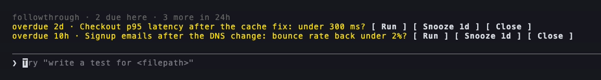

# followthrough

Durable follow-up checks for changes shipped with coding agents. When an agent says "I'll check the result in
24 hours", followthrough makes sure that check survives the session, reaches a verdict, and shows up in one list.

Status: early. In daily use by the author since 23 Sep 2026, on macOS, with Claude Code (and Codex through the
skill). How it works, the decisions behind it, the first week's numbers and what is not built: `docs/DESIGN.md`.

## What it does today

- A SQLite ledger of claims (`~/.followthrough/`, private files) and a `followthrough` CLI.
- Hooks and a launchd job (`followthrough install-runner`, every 2 minutes) that capture in-session reminders -
  one-shot `CronCreate` calls set 30 minutes or more ahead, and recurring ones that run daily or less often (their
  next 7 days of fires) - notice when they fire, move due checks to "needs you", notify, and flag claims still
  without a verdict after their end time as overdue (they stay open until you record a verdict or cancel them).
- Notifications: macOS (with `terminal-notifier`, clicking opens a Terminal running `followthrough open <id>`, a
  Claude session for the check) and, optionally, Telegram with the check's details and as much of the runbook as
  fits. When a reminder ran in its session but recorded no verdict, the Telegram notice carries that session's last
  reply. (The interim readings of a daily series that ran in their session are not notified; `status` shows them.)
- Nothing runs an agent unattended.

## Install

```
git clone https://github.com/BayramAnnakov/followthrough
uv tool install ./followthrough               # puts `followthrough` on PATH (~/.local/bin); -e to hack on it
followthrough install                         # skill (Claude Code + Codex), hooks, launchd runner; prints next steps
```

`followthrough install` changes your machine, so read this first. It:

- copies the skill into `~/.claude/skills/followthrough/` and `~/.codex/skills/followthrough/`;
- writes a commented `~/.followthrough/config.toml` if there is none;
- merges its hooks into `~/.claude/settings.json` (backed up first as `settings.json.bak-followthrough-<time>`;
  `--no-session-start` skips the session-start overview) and adds the ledger's `data/` folder to
  `sandbox.filesystem.allowWrite` there. The `PreToolUse` hook rewrites each reminder it captures (it adds a claim
  line to the prompt) and returns `allow` for it; Claude Code does not ask permission for `CronCreate` anyway;
- installs and loads the launchd job. Its first tick scans your Claude Code transcripts from the last 45 days:
  reminders still ahead become claims, and one-shot reminders that came due in the last 48 hours come in as due, so
  the first notifications can arrive within minutes. To keep some folders out (a bot, a client's repo), create
  `~/.followthrough/config.toml` with `ignore_paths = ["~/path"]` before running `install`.

By hand afterwards:

- `tz` in `~/.followthrough/config.toml` - the zone your sessions run in (defaults to the system zone).
- `user_names = ["Sam"]` in the same file - the names your reminders use for you ("ask Sam", "reminder for Sam"), so
  those reminders are filed as `ask` (a decision for you) rather than `verify`.
- `brew install terminal-notifier` - clickable macOS notifications.
- Telegram (optional): `[telegram] enabled = true`, `env_file`, `token_key`, `chat_id`. `open_button = true` adds an
  "Open on Mac" button to each message; it only works if a process polling that bot's updates handles callback data
  `ft:open:<id>` by running `followthrough open-terminal <id>`. `snooze_buttons = ["1h", "3h", "morning"]` adds a
  row of snooze buttons; their callback data is `ft:snooze:<id>:<for>`, for the same process to run
  `followthrough snooze <id> --for <for> --source telegram-button`. `close_button = true` ends that row with a
  "close" button, `ft:close:<id>` (it adds a button: `snooze_buttons = ["3h", "morning"]` with it gives "3h, till
  9:00, close"), for closing a check without running it: the handler asks for a second tap
  (`ft:close:<id>:y`) and then runs `followthrough abandon <id> --reason "…"`. followthrough does not ship that
  handler yet.
- Codex: add `~/.followthrough/data` to `[sandbox_workspace_write] writable_roots` in `~/.codex/config.toml`, and a
  line to `~/.codex/AGENTS.md` pointing at the skill.

## A first check

From inside a git repository (a claim is filed under the repo you are in):

```
followthrough add "p95 after cache fix" --at +2m --expect "p95 below 10 s" \
  --runbook "Read the p95 of /api/search for the last hour from the dashboard; compare with 20.8 s."
followthrough status                          # one open claim, due in 2 minutes
```

Within about 4 minutes the runner moves it to "needs you" and notifies you. Click the notification (or run
`followthrough open <id>`): a Claude session starts in the repo with the check's instructions, takes the lease
(`followthrough start`), does the check and records the verdict (`followthrough resolve`). `followthrough show <id>`
prints the history.

## Requirements and assumptions

- macOS (launchd, `osascript`). Linux scheduling is not written yet.
- `git` (claims are filed under the repo you are in) and `ps` (to tell whether a check's agent is still running).
- Python 3.11+ and `uv`.
- Claude Code transcripts in `~/.claude/projects/`. The scanner reads their structure (`CronCreate` results,
  `CronDelete` results, `scheduledTaskId` on fired prompts); a Claude Code format change can break capture.
- Layout: `~/.followthrough/config.toml` (trusted settings), `data/` (the ledger and `attachments/` - the only part
  an agent sandbox needs to write), `prompts/`, `logs/`.
- Telegram messages are sent with `curl`; the token goes to curl on stdin, never on the command line. If another
  process already polls that bot's updates, the "Open on Mac" button (if enabled) has to be handled there (Telegram
  allows one consumer per bot).
- Secret-shaped strings are redacted from what followthrough stores and sends. Redaction is a safety net, not a
  guarantee: keep secrets out of reminders and runbooks.

## Commands

```
followthrough status [--repo DIR] [--brief]      what is waiting, most urgent first
followthrough add "title" --at +24h --runbook "…" register a check by hand (--repo defaults to the git repo here)
followthrough attach <id> <file|dir>...           copy files a check needs into the ledger
followthrough open <id>                           start a Claude session for the check
followthrough start <id>                          take the lease (prints OK <attempt-id>)
followthrough resolve <id> --attempt <attempt-id> --verdict worked|failed|partial|inconclusive|not_settled --summary "…"
followthrough amend <id> --verdict … --summary "…" --reason "…"   change a closed verdict when the user asks
followthrough expect <id> "…"                     set a captured claim's expectation (once)
followthrough snooze <id> --for 3h|morning      hold its notifications; one reminder follows (--off to end)
followthrough cancel <id> --reason "…"           (or abandon: no longer worth checking)
followthrough show <id>                           checkpoints and history
followthrough import-crons [--rescan]             scan transcripts now
followthrough install | install-hooks | install-runner | uninstall-runner
```

Tests, from the clone: `cd followthrough && uv venv .venv && uv pip install -e . pytest && .venv/bin/python -m pytest`.

## In the session: followthrough-band (Claude Code mod, early access)

A [Claude Code mod](https://claude.dev/blog/getting-started-with-claude-code-mods/) puts the checks due for the repo
you are in above the prompt, with **Run**, **Snooze 1d** and **Close**, and nudges a session that ships (a merge, a
deploy, a publish) without registering a check.



```bash
claude plugin marketplace add bayramannakov/followthrough
claude plugin install followthrough-band@followthrough
```

Needs the CLI above and Claude Code 2.1.286+ with mods. Details: [`mod/README.md`](mod/README.md).

## Uninstall

```
followthrough uninstall-runner                    # stop and remove the launchd job
followthrough install-hooks --remove              # take the hooks (and the sandbox entry) out of ~/.claude/settings.json
rm -r ~/.claude/skills/followthrough ~/.codex/skills/followthrough
uv tool uninstall followthrough
```

If you set up Codex, remove the `writable_roots` entry and the `AGENTS.md` line you added. The settings backups
(`~/.claude/settings.json.bak-followthrough-*`) and the ledger (`~/.followthrough/`) stay until you delete them.

## License

MIT - see `LICENSE`.
